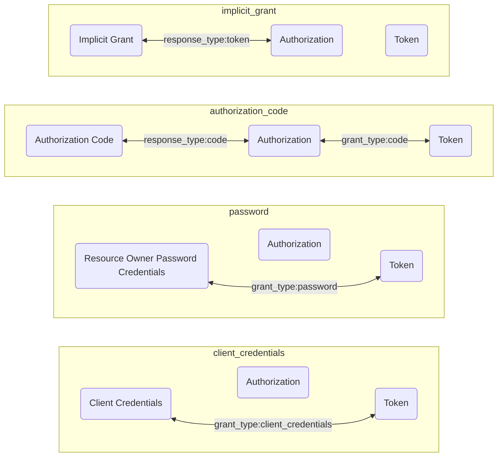

```mermaid
flowchart LR
    implicit(Implicit Grant)
    code(Authorization Code)
    pass(Resource Owner Password Credentials)
    client(Client Credentials)
    a1(Authorization)
    a2(Authorization)
    a3(Authorization)
    a4(Authorization)
    t1(Token)
    t2(Token)
    t3(Token)
    t4(Token)

    subgraph client_credentials
        direction LR
        client ~~~ a4 ~~~ t4
        client <-- grant_type:client_credentials --> t4
    end

    subgraph password
        direction LR
        pass ~~~ a3 ~~~ t3
        pass <-- grant_type:password --> t3
    end

    subgraph authorization_code
        direction LR
        code <-- response_type:code --> a2 <-- grant_type:code --> t2
    end
    
    subgraph implicit_grant
        direction LR
        implicit <-- response_type:token --> a1 ~~~ t1
    end
    
    
    
```