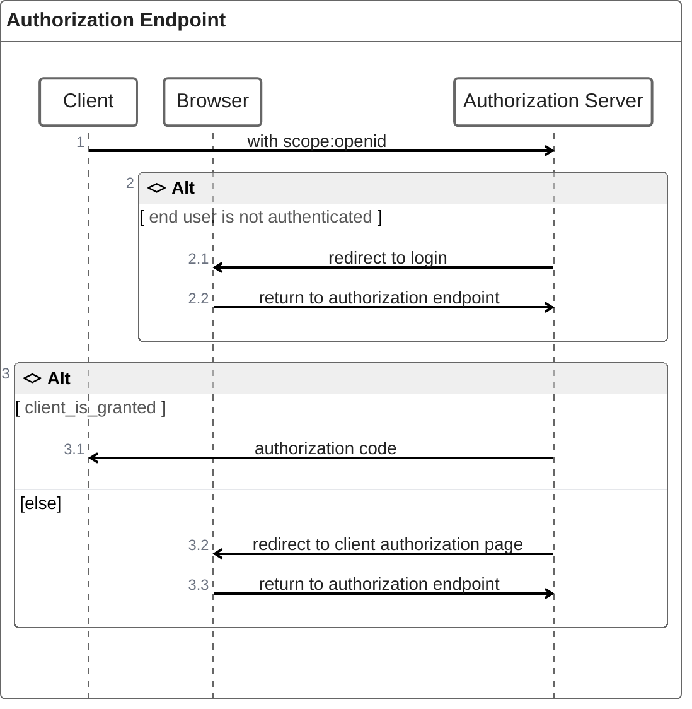
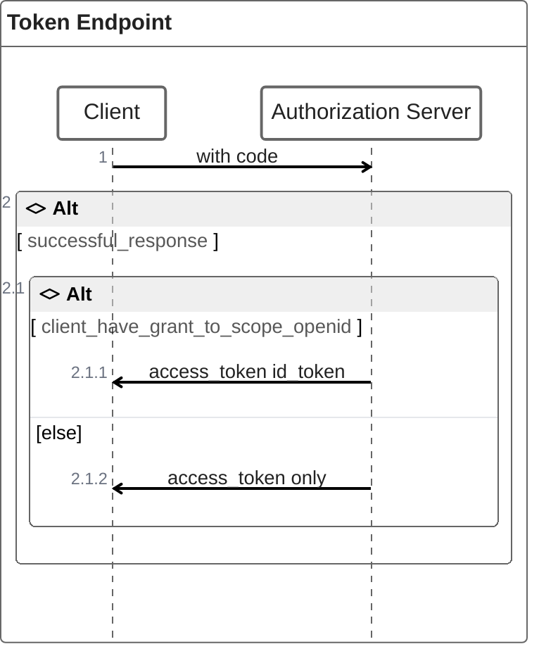

```mermaid
zenuml
    title Authorization Endpoint
    C as Client  B as Browser AS as "Authorization Server"
    C->AS: with scope:openid
    if("end user is not authenticated"){
        AS->B: redirect to login
        B->AS: return to authorization endpoint
    }
    if(client_is_granted) {
        AS->C: authorization code
    }
    else {
        AS->B: redirect to client authorization page
        B->AS: return to authorization endpoint
    }
```

```mermaid
zenuml
    title Token Endpoint
    C as Client AS as "Authorization Server"
    C->AS: with code
    if(successful_response){
        if(client_have_grant_to_scope_openid) {
            AS->C:access_token id_token
        }
        else {
            AS->C:access_token only
        }
    }
```